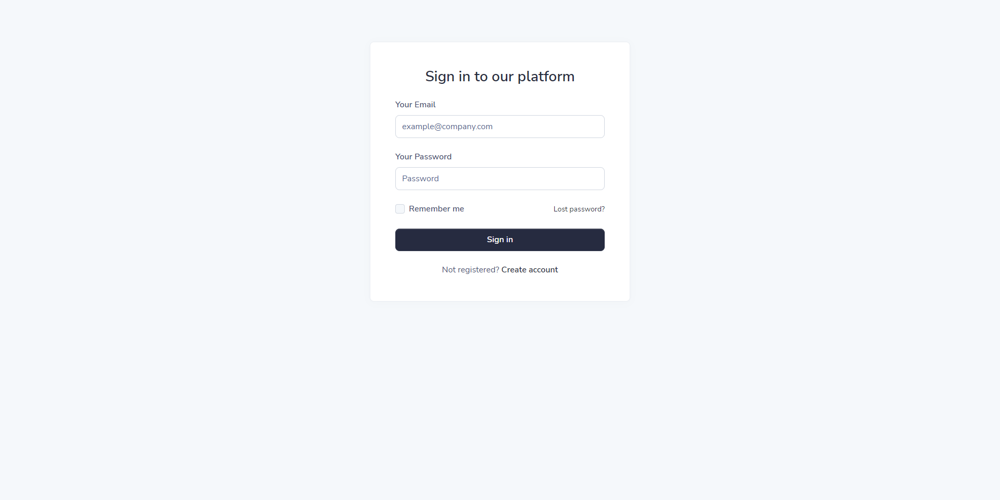
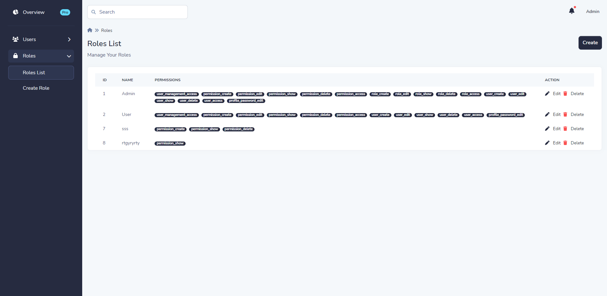
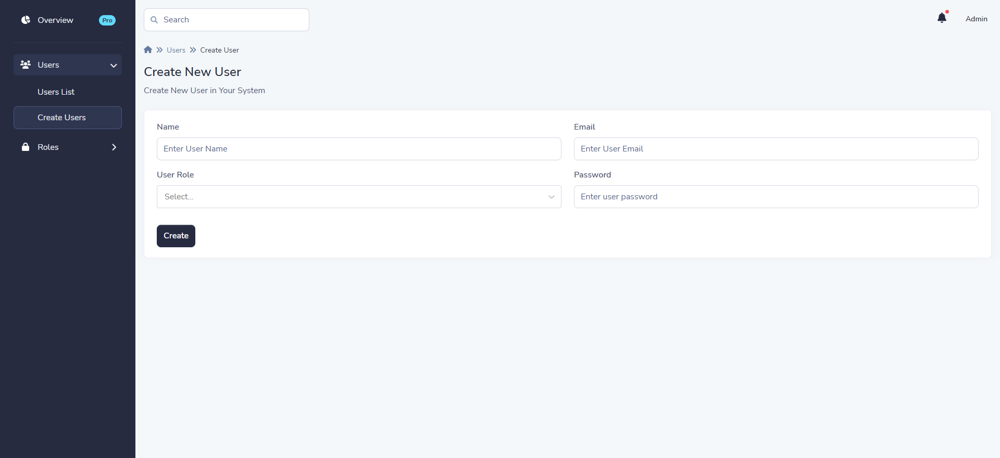

<h1>Laravel ReactJS Dashboard</h1>

<h2>A laravel dashboard built in InertiaJs + ReactJs</h2>
<p>Laravel + Bootstrap + ReactJS + InertiaJS + laravel-permission </p>

<h2>Screenshot</h2>





<h3>Setup</h3>
```bash
#install composer dependency
composer install
# copy .env.example to .env
cp .env.example .env
# generate security key , link storage file
php artisan key:generate
php artisan storage:link
# after connect your database via .env file
php artisan migrate:fresh
php artisan db:seed
```

<h3>Credentials</h3>
```
login url : <http://127.0.0.1:8000/login>
email : admin@admin.com
password : password
```


<h2>Built With</h2>
* [Laravel](https://laravel.com/)
* [ReactJs](https://reactjs.org/)
* [InertiaJS](https://inertiajs.com/)
* [Bootstrap](https://getbootstrap.com/)

<h2>Contributing</h2>
Thank you for contributing to this repository.

<h2>Acknowledgments</h2>
We acknowledge and are grateful to these developers for their contributions to open source.
* [Volt React Dashboard](https://demo.themesberg.com/volt-react-dashboard/#/)
* [laravel-permission](https://spatie.be/docs/laravel-permission/v5/introduction)


<h2>License</h2>
This project is licensed under the MIT License - see the [LICENSE](LICENSE) file for details
